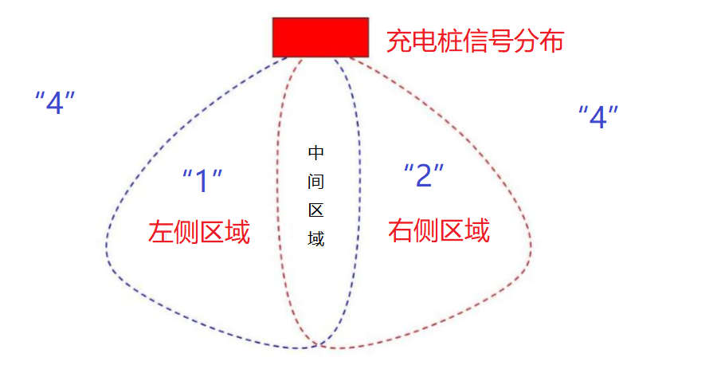
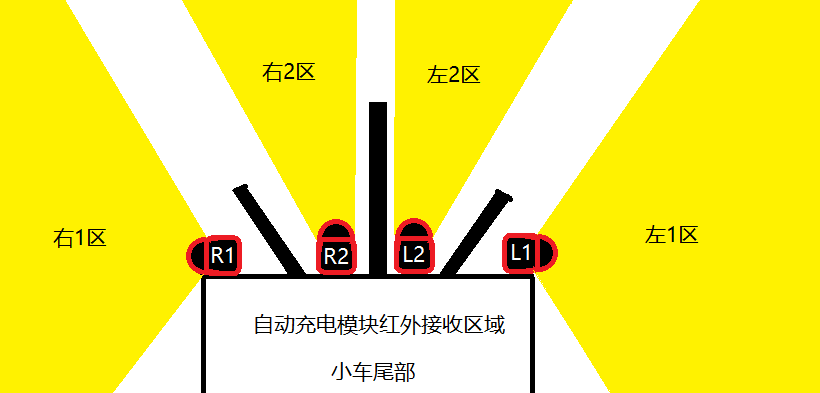

# 红外传感器探测到的信号值的定义

充电桩会自动广播三组信号值，分别为“4”、“1”、“2”。

第一组信号值由充电桩顶部360度红外灯发射，充电模块的红外探测器侦测到这个信号后，对应的值会增加4。

第二组信号值由充电桩正前面左侧红外灯发射，充电模块的红外探测器侦测到这个信号后，对应的值会增加1。

第二组信号值由充电桩正前面右侧红外灯发射，充电模块的红外探测器侦测到这个信号后，对应的值会增加2。

信号值可以叠加，即由“4”、“1”、“2”组合得到的值可以分析得到当前传感器相对充电桩的位置。由4个传感器的值，可以进一步得到充电模块相对充电桩的位置。

